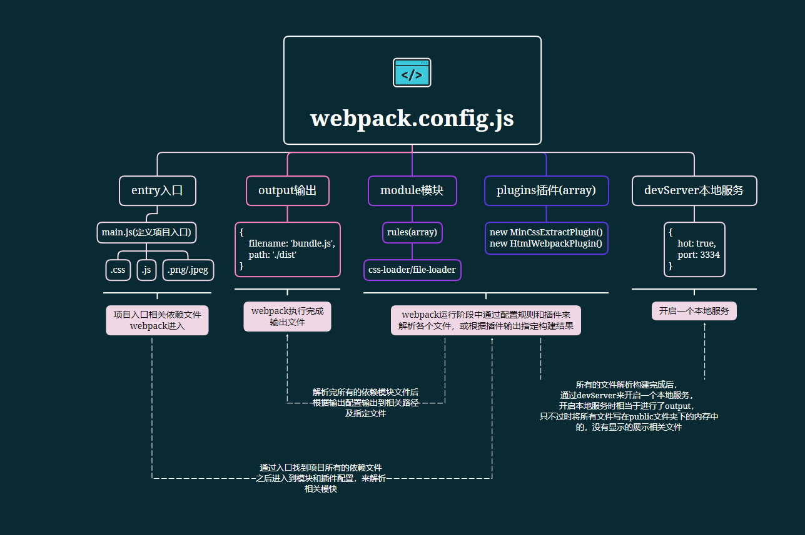

### In-depth webpack study notes and examples

```javascript
cd chapterName // 进入相应章节如：cd chapter1
npx webpack // 运行webpack进行打包
npx webpack-dev-serve // 开启devserver
```


  #### 第一章
  ##### 基本使用
  ```javascript
  // --main.js file-- CommonJS 规范引入相关模块
  // 在加载相关文件时规定解析规则
  // require('style-loader!css-loader!./css/main.css')

  require('./css/main.css');
  const show = require('./js/show.js');

  show('webpack');
  ```

  ```javascript
    // --webpack.config.js file--
    const path = require('path');
    module.exports = {
      // 定义打包入口文件
      entry: path.join(__dirname, './main.js'),
      // 定义打包完成后输出路径及文件名
      output: {
        filename: 'bundle.js',
        path: path.join(__dirname, '/dist')
      },
      module: {
        // 文件解析规则
        rules: [
          {
            // 文件后缀名
            test: /\.css$/,
            // 文件解析使用的loader，从后往前进行解析
            use: ['style-loader', {
              loader: 'css-loader',
              options: {
                minimize: true
              }
            }]
          }
        ]
      }
    }
  ```
  ##### 基本概念
  - entry: 打包的入口文件配置，定义webpack从哪个文件开始打包-https://webpack.docschina.org/configuration/entry-context/#entry
  - output: 打包后输出文件相关配置位置，定义webpack将所有文件打包完成后输出到哪里及输出命名等相关配置-https://webpack.docschina.org/configuration/output/
  - module: 定义如何处理打包时遇到的不同模块-https://webpack.docschina.org/configuration/module/
    - rules: 定义不同文件的解析规则-https://webpack.docschina.org/configuration/module/#rule
  - plugins: 插件，通过不同的插件来改变webpack的构建结果(打包结果)-https://webpack.docschina.org/configuration/plugins/

  ##### 第一章总结



  #### 第二章
  ##### 常用配置项

  - **context**:  打包路径上下文配置 https://webpack.docschina.org/configuration/entry-context/
    - 定义webpack中其他配置路径都相对于`context`中的配置来进行查找, 且`context`必须是一个绝对路径。
    ```javascript
      const path = require('path');
      module.exports = {
        context: path.join(__dirname, 'src'), // D:/webpacknotes/chapter2/context
        entry: './main.js' // D:/webpacknotes/chapter2/context/main.js
      }
    ```

  - **entry**:  打包入口文件配置 https://webpack.docschina.org/configuration/entry-context/

    | entry值类型 | 示例                                                         | 说明                                                         |
    | ----------- | ------------------------------------------------------------ | ------------------------------------------------------------ |
    | string      | `./src.main.js`                                              | 定义一个入口路径，指定webpack打包从哪个路径的文件开始，      |
    | array       | `['./src/a.js', './src/b.js']`                               | 定义多个入口路径，指定多个入口，但是只有数组的最后一个路径会被导出 |
    | object      | ``` { a: './src/a.js', b: 'src/b.js' } ```                   | 定义多个入口路径，每一个入口路径可以输出一个相应的打包文件   |
    | function    | entry: () => {<br>  return: {<br>    a: './src/a.js',<br>    b: './src/b.js'<br>  }<br>} | 配置动态入口，一般用于要导出多页面的应用，通过同步，异步函数导出动态配置 |

  - **output**:  配置打包完成后输入文件相关配置 https://webpack.docschina.org/configuration/output/
    - **filename**:  输出文件命名配置
    - **path**:  输出文件路径配置
    ```javascript
      const path = require('path');
      module.exports = {
        entry: './main.js',
        output: {
          filename: '[name].js', // [id].js,[hash:8].js
          path: './dist_[hash]'
        }
      }
    ```

|变量名称|示例|说明|
|---|---|---|
|[id]|[id].js => 172.js|chunk的唯一标识符，从数字0开始。以id为输出文件命名|
|[ext]|a.[ext] => a.js|webpack处理文件的拓展名如处理.js时输出的变量ext为.js|
|[name]|[name].js => main.js|处理的文件名称，输出的文件名称和处理的文件名称相同|
|[hash]|[hash].js => ab9f555e8d2f4b7ff365.js|根据文件内容输出的hash来命名输出文件|
|[contenthash]|[contentHash].js => ab9f555e8d2f4b7ff365.js| 根据文件内容输出的hash来命名输出文件                         |
|[hash:8]|[hash:2].js => ab.js|根据文件内容输出指定长度的hash来命名文件，后面的数字为输出的长度|
|[path]||文件相对于webpack的配置文件的路径来命名输出文件在**相应的文件模板插件才能使用**|

- **module**: 模块解析相关配置 https://webpack.docschina.org/configuration/module/
  - **rules** 配置不同文件如何进行解析 https://webpack.docschina.org/configuration/module/#modulerules
    - **parser** 指定模块中的哪些语法是否进行解析 https://webpack.docschina.org/configuration/module/#ruleparser
    - **include** 对符合路径的文件夹中命中的文件类型进行解析 https://webpack.docschina.org/configuration/module/#ruleinclude
    - **exclude** 不对符合路径的文件夹中命中的文件类型进行解析 https://webpack.docschina.org/configuration/module/#ruleexclude
    - **enforce** 强制更改loader解析顺序pre(前置)，post(后置)，inline(行内) https://webpack.docschina.org/configuration/module/#ruleenforce
  - **noParse** 对某些符合指定规则的模块不进行解析，从而提高构建性能 https://webpack.docschina.org/configuration/module/#modulenoparse

```javascript
module.exports = {
  entry: './main.js',
  output: {
    filename: 'bundle.js',
    path: path.join(__dirname, './dist')
  },
  module: {
    rules: [
      {
        test: /\.js$/,
        use: ['babel-loader'],
        include: path.join(__dirname, './src'),  // 只对src文件夹中的js进行babel解析
        exclude: path.join(__dirname, './node_modules'), // 排除对node_modules文件夹中的js进行babel解析
        parse: {
          amd: false, // 禁用 AMD
          commonjs: false, // 禁用 CommonJS
        }
      },
      {
        test: /\.css$/,
        use: [ // 使用enforce强制更改loader执行顺序,loader执行顺序为scss-loader,css-loader,style-loader
          'style-loader',
          {
            loader: 'scss-loader',
            enforce: 'pre' // post(后置，最后执行),pre(前置,放在最前执行),inline,normal
          },
          'css-loader'
        ]
      }
    ],
    noParse: /jquery|loadsh/, // 配置webpack忽略对没有标准化的模块进行处理，从而提高构建性能
  }
}
```

- **resolve**: 定义webpack如何查找解析相应模块所对应的文件
  - **alias** 配置别名，将某个符合别名关键字的模块路径，替换为别名所定义的路径  https://webpack.docschina.org/configuration/resolve/#resolvealias
  - **mainFields** 规定使用那种方式来导入第三方模块 https://webpack.docschina.org/configuration/resolve/#resolvemainfields
  - **extensions** 当导入模块没有指定后缀名时，规定webpack自动添加哪些后缀来解析 https://webpack.docschina.org/configuration/resolve/#resolveextensions
  - **modules** 规定在哪些目录里查找模块 https://webpack.docschina.org/configuration/resolve/#resolvemodules
  - **enforceExtension** 规定在导入模块时是否必须带上后缀名 https://webpack.docschina.org/configuration/resolve/#resolveenforceextension
```javascript
module.exports = {
  entry: './main.js',
  output: {
    filename: 'bundle.js',
    path: path.join(__dirname, './dist')
  },
  module: {
    rules: [
      {
        test: /\.js$/,
        use: ['babel-loader'],
        include: path.join(__dirname, './src'),  // 只对src文件夹中的js进行babel解析
        exclude: path.join(__dirname, './node_modules'), // 排除对node_modules文件夹中的js进行babel解析
        parse: {
          amd: false, // 禁用 AMD
          commonjs: false, // 禁用 CommonJS
        }
      },
      {
        test: /\.scss$/,
        use: 'style-loader',
      },
      {
        test: /\.scss$/,
        use: 'sass-loader',
        enforce: 'pre' // 优先使用sass-loader解析scss文件,解析顺序为sass-loader,css-loader,style-loader
      },
      {
        test: /\.scss$/,
        use: 'css-loader',
      }
    ],
    noParse: /jquery|loadsh/, // 配置webpack忽略对没有标准化的模块进行处理，从而提高构建性能
    resolve: {
      alias: {
        staticJs: path.join(__dirname, '../chapter2/js'),
        'scssFile$': path.join(__dirname, '../chapter2/css/index.scss')
      }
    },
  }
}

// 相关依赖示例
import myExclude from 'staticJs/exclude/exclude.js'; // alias解析为：import myExclude from '../chapter2/js/exclude/exclude.js'
import 'scssFile'; // alias解析为：import scssFile from '../chapter2/css/index.scss'
```

- **plugins**: 定义webpack插件，用于拓展webpack的功能 https://webpack.docschina.org/configuration/plugins/#plugins
- **devServer**: 启动一个本地开发服务 https://webpack.docschina.org/configuration/dev-server/
- **devtool**: 是否开启资源映射，方便排错 https://webpack.docschina.org/configuration/devtool/
- **target**: 指定webpack打包出那种环境下的代码 https://webpack.docschina.org/configuration/target/
- **watch&watchOptions**: 配置webpack是否开启文件监听及如何监听 https://webpack.docschina.org/configuration/watch/
- **externals**: 配置webpack哪些外部引用的模块不用打包，防止重复打包 https://webpack.docschina.org/configuration/externals/#externals
- **resolveLoader** 定义webpack如何查找解析相应的loader https://webpack.docschina.org/configuration/resolve/#resolveloader

##### 第二章总结
- 指定webpack打包入口配置：entry
- 指定webpack打包输出配置：output
- 配置webpack如何解析和转换文件：module,module.rules
- 配置webpack模块,loader的查找规则: resolve,resolveLoader
- 拓展webpack功能：plugins
- 配置webpack本地服务：devServer