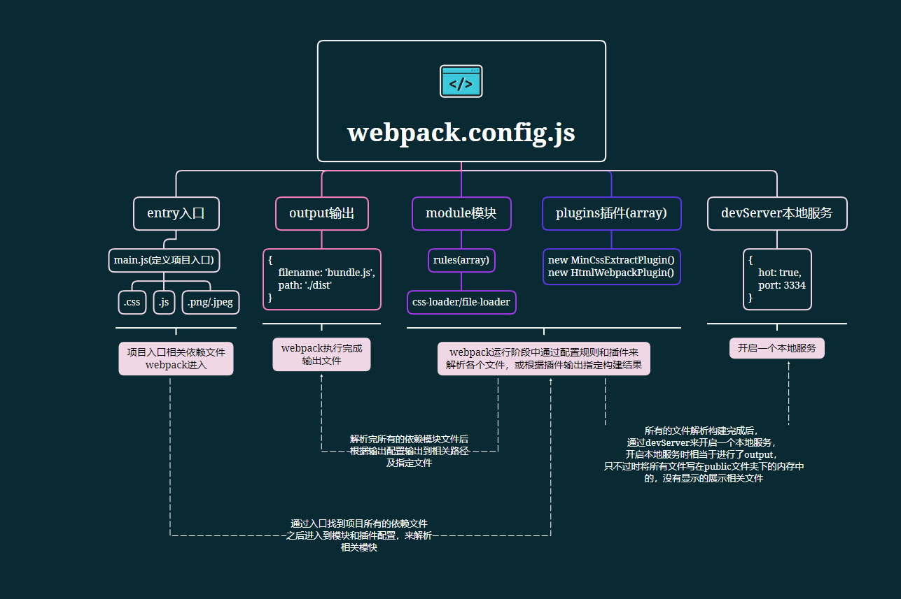

### In-depth webpack study notes and examples

```javascript
cd chapterName // 进入相应章节如：cd chapter1
npx webpack // 运行webpack进行打包
npx webpack-dev-serve // 开启devserver
```


  #### 第一章
  ##### 基本使用
  ```javascript
  // --main.js file-- CommonJS 规范引入相关模块
  // 在加载相关文件时规定解析规则
  // require('style-loader!css-loader!./css/main.css')

  require('./css/main.css');
  const show = require('./js/show.js');

  show('webpack');
  ```

  ```javascript
    // --webpack.config.js file--
    const path = require('path');
    module.exports = {
      // 定义打包入口文件
      entry: path.join(__dirname, './main.js'),
      // 定义打包完成后输出路径及文件名
      output: {
        filename: 'bundle.js',
        path: path.join(__dirname, '/dist')
      },
      module: {
        // 文件解析规则
        rules: [
          {
            // 文件后缀名
            test: /\.css$/,
            // 文件解析使用的loader，从后往前进行解析
            use: ['style-loader', {
              loader: 'css-loader',
              options: {
                minimize: true
              }
            }]
          }
        ]
      }
    }
  ```
  ##### 基本概念
  - entry: 打包的入口文件配置，定义webpack从哪个文件开始打包-https://webpack.docschina.org/configuration/entry-context/#entry
  - output: 打包后输出文件相关配置位置，定义webpack将所有文件打包完成后输出到哪里及输出命名等相关配置-https://webpack.docschina.org/configuration/output/
  - module: 定义如何处理打包时遇到的不同模块-https://webpack.docschina.org/configuration/module/
    - rules: 定义不同文件的解析规则-https://webpack.docschina.org/configuration/module/#rule
  - plugins: 插件，通过不同的插件来改变webpack的构建结果(打包结果)-https://webpack.docschina.org/configuration/plugins/

  ##### 第一章总结



